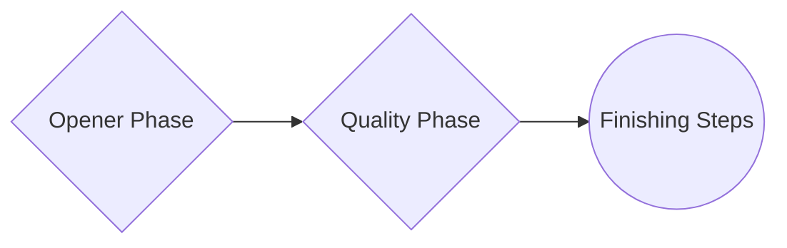
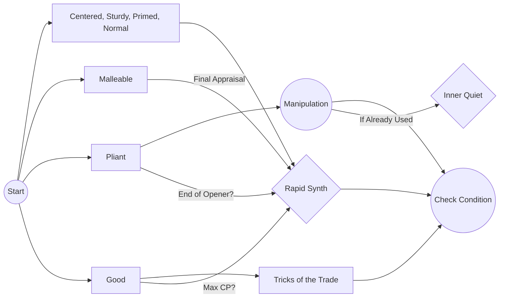
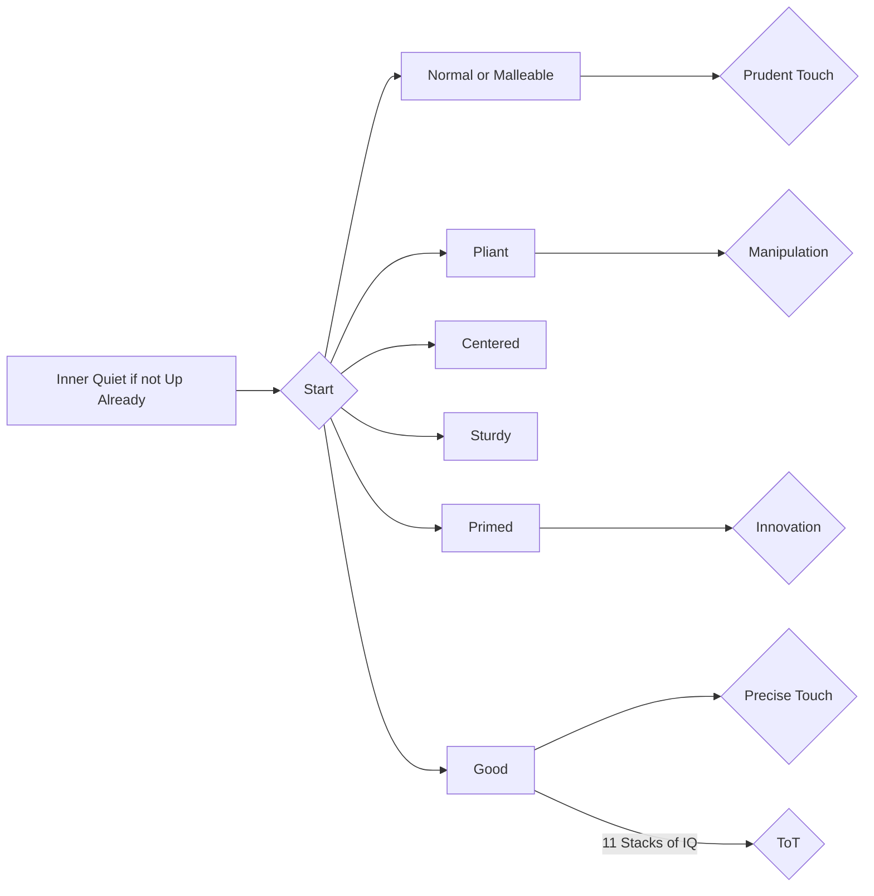

> *If you wish to make an apple pie from scratch, you must first invent the universe* - Carl Sagan

<!--more-->

# Expert Crafting
***Expert Crafts*** were originally designed to be some of the most complicated crafts, with Higher than normal Quality maximums and strict gear requirements. With the addition of 6.0 Endwalker, things have certainly gotten easier in time. This guide aims to explain the basics behind ***Expert Crafting*** and serve as an entry point for anyone looking to get started or fine tune their process.

### Conditions
There are no *Excellent* or *Poor* conditions with ***Expert Crafting***, but there are 5 new status conditions to watch out for:

-   Centered - *Increases action success rate by 25%*
-   Sturdy - *Reduces loss of durability by 50% (Can stack with Waste Not)*
-   Pliant - *Reduces CP cost by 50%*
-   Malleable - *Increases to progress are 1.5 times higher than normal (be careful, it multiplies not adds on buffs so it's slightly stronger than veneration)*
- Primed - *Next status granted by an action will last 2 additional steps*

### Crafting Phases

#### Opener Phase
The **Opener Phase** is where you ideally want to build up as much progress as you can, start *Inner Quiet*, and have *Manipulation* up depending on your Condition RNG. For this you'll be focusing on item *conditions*, using skills and buffs as you make your way towards Progress completion. You'll want to repeat these steps until you are one progress skill away from completing your craft. It doesn't matter what skill you use to complete the craft in the ***Finishing Phase*** (*Basic Synth, Careful Synth, etc.*), the key thing to remember is not to complete the craft before completing your Quality Phase!

#### Quality Phase
The **Quality Phase** is easily the most complicated portion of these Expert Crafts. Your goal during this portion is to build 11 stacks of Inner Quiet, while maintaining your Crafting Points (CP), and making sure you don'r run out of Durability. Sounds complex, but its actually pretty easy to get into a rhythm once you're used to seeing Conditions and reacting to them.

#### Finisher Phase

**Under Construction**
