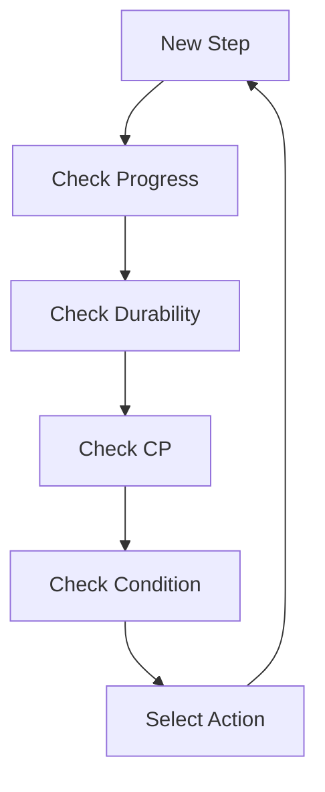
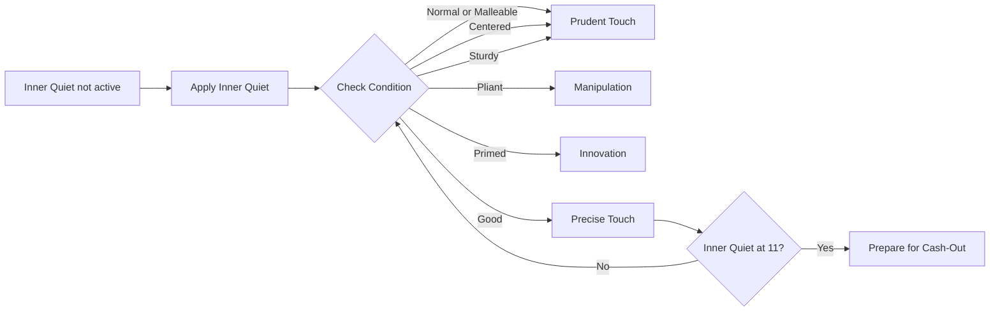
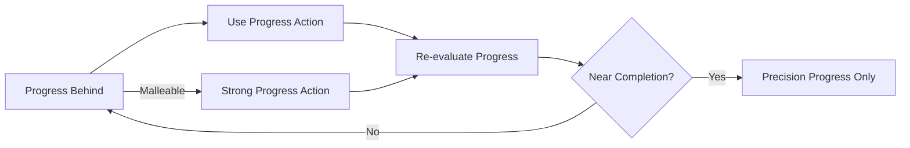
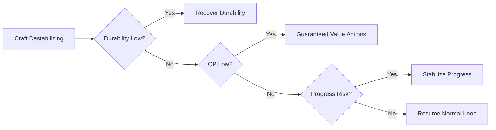

> *If you wish to make an apple pie from scratch, you must first invent the universe.*  
> — Carl Sagan

## Expert Crafting

Expert crafting exists to remove the illusion that crafting in Final Fantasy XIV is solved. These recipes were designed to resist macro automation, enforce resource awareness, and reward the crafter who understands why an action is chosen rather than merely when.

While later expansions have softened the gear requirements and expanded available tools, the underlying structure of expert crafts has remained intact. Success is not determined by memorization, but by adaptation.

This guide outlines the systems that govern expert crafting and the principles that make it manageable.

---

## What Makes a Craft “Expert”

Expert recipes differ from standard crafts in three important ways:

- Higher quality ceilings, requiring deliberate quality investment  
- Unpredictable conditions, replacing Excellent and Poor  
- Narrow margins, where mismanagement compounds quickly  

These elements shift the focus from execution to evaluation. Every step asks a question. The craft ends when you stop answering them correctly.

---

## Conditions

Expert crafting replaces traditional condition states with five specialized statuses. These conditions are the primary source of variance and opportunity.

There are no Excellent or Poor conditions. Instead, the following states appear:

### Centered
Increases action success rate by **25%**.

Centered reduces risk. It does not increase output, but it enables consistency when using actions with failure chance.

### Sturdy
Reduces durability loss by **50%**.

Sturdy stacks multiplicatively with effects such as *Waste Not*, allowing extended setup and safer progress advancement.

### Pliant
Reduces CP cost by **50%**.

Pliant is the primary window for high-efficiency CP spending. Poor use of this condition often leads to late-stage instability.

### Malleable
Increases progress gains by **1.5×**.

Malleable multiplies progress bonuses rather than adding to them. While powerful, it must be managed carefully to avoid premature completion.

### Primed
Extends the duration of the next status applied by an action by **2 additional steps**.

Primed rewards foresight. Its value depends entirely on what follows.

---

## Condition Usage Matrix

| Condition  | Primary Use Case              | Common Misuse                  |
|-----------|-------------------------------|--------------------------------|
| Centered  | Risk reduction                | Treated as a payoff window     |
| Sturdy    | Durability extension           | Ignored or underutilized       |
| Pliant    | High-cost action deployment    | CP overspending without plan   |
| Malleable | Controlled progress gain       | Accidental craft completion    |
| Primed    | Buff extension setup           | Immediate low-value action     |

Conditions should be leveraged deliberately, not reflexively.

---

## Resources and Constraints

Expert crafting is governed by three finite resources:

- Durability  
- CP  
- Remaining progress  

These resources are interdependent. The purpose of most actions is not immediate gain, but future flexibility.

A craft typically fails when one resource collapses before the others can compensate.

### Resource Interaction Table

| Resource     | When Healthy                      | When Failing                          | Typical Result |
|-------------|-----------------------------------|---------------------------------------|----------------|
| Durability  | Allows setup and recovery          | Limits remaining decisions            | Forced finish |
| CP          | Enables adaptation                 | Removes flexibility                   | Low quality   |
| Progress    | Under controlled threshold         | Accidentally completed or lagging     | Premature end |

---

## The Expert Crafting Decision Loop

Expert crafting is best understood as a repeated evaluation cycle. Each step narrows the set of acceptable actions.

Skipping any node in this loop introduces instability.

---

## Quality Phase

The **Quality Phase** is the most cognitively demanding portion of an expert craft. The objective is to reach **11 stacks of Inner Quiet** while preserving CP and durability. This phase rewards pattern recognition rather than speed.

---

## Quality Spending Heuristic

| Situation                         | Recommended Action      |
|----------------------------------|-------------------------|
| Neutral or poor condition        | Setup or stabilize      |
| Favorable condition + CP buffer  | High-impact quality     |
| Low CP, high durability          | Guaranteed value        |
| Low durability                   | Stop gambling           |

Quality is not accumulated continuously. It is harvested selectively.

---

## Progress Management

Progress should be advanced deliberately. Overshooting progress is a common and costly error.

### Progress Control Thresholds

| Progress State     | Recommended Behavior              |
|-------------------|-----------------------------------|
| Far from complete | Safe setup, condition fishing     |
| Mid-range         | Controlled progress advances      |
| Near completion   | Precision actions only            |
| Finish-ready      | Commit intentionally              |

Overshooting progress is not a timing error. It is a planning failure.

---

## Durability Recovery

Durability recovery increases available decision space. Its value lies not in the recovery itself, but in what the recovered steps enable.

Recovery without purpose frequently results in wasted resources.

---

## Failure Recovery Decision Tree

---

## Post-Endwalker vs Ishgard Restoration Expert Crafting

Although the mechanics of expert crafting remain consistent, the experience differs notably between the Ishgard Restoration era and post-Endwalker content.

### Ishgard Restoration Era

- Strict gear and meld requirements  
- Tight CP margins  
- Limited recovery tools  
- Failure often irreversible  

### Post-Endwalker Era

- Higher baseline stats  
- Expanded recovery options  
- Greater tolerance for mistakes  
- Overconfidence becomes the primary risk  

The system remains intact; only the margins have widened.

---

## Common Failure Patterns

- Early overcommitment  
- Accidental progress completion  
- Condition tunnel vision  

### Failure Diagnosis Table

| Symptom                       | Root Cause                   |
|------------------------------|------------------------------|
| Ran out of CP                | Early overcommitment         |
| Finished too early           | Uncontrolled progress        |
| High durability, low quality | Missed condition exploitation|
| Sudden collapse              | No recovery buffer           |

---

## Practice and Improvement

Improvement comes from post-run analysis rather than repetition.

After each failure, identify:
- Which resource failed first  
- Why recovery was no longer possible  

---

## Closing Thoughts

Expert crafting is not designed to be comfortable. It exists to reward patience, awareness, and restraint.

When the craft feels difficult, it is functioning as intended.

Mastery comes when the process feels conversational rather than chaotic.

---

*This guide focuses on system understanding rather than patch-specific rotations.*
